# Gramatyka grafowa do rekurencyjnej adaptacji siatek czworokątnych

## Grupa 3 - produkcje P5 i P6

#### Andrzej Ratajczak i Filip Zybała

#### 15.01.2022

## P5

[test1](../../tests/test_p5.py)
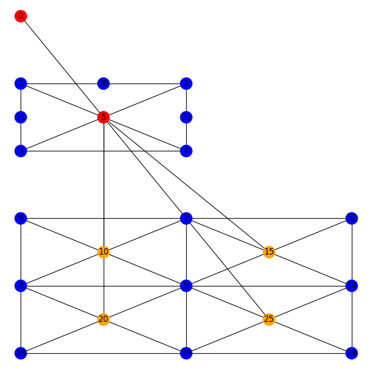

### 1. Czy produkcja sprawdza czy graf (podgraf grafu) do którego chcemy zastosować produkcję jest izomorficzny z grafem lewej strony produkcji (czy da się ją wykonać)? 

#### a) czy zmiana grafu do którego stosujemy produkcję poprzez usunięcie losowego wierzchołka nie psuje tego mechanizmu

[test2](../../tests/test_p5.py)
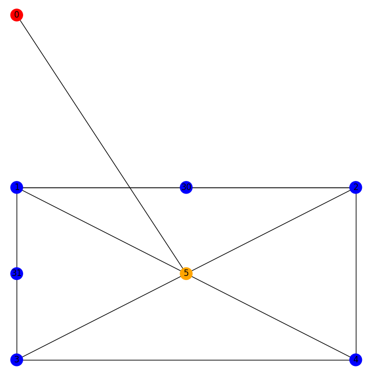

#### b) czy zmiana grafu do którego stosujemy produkcję poprzez usunięcie losowej krawędzi nie psuje tego mechanizmu

[test3](../../tests/test_p5.py)
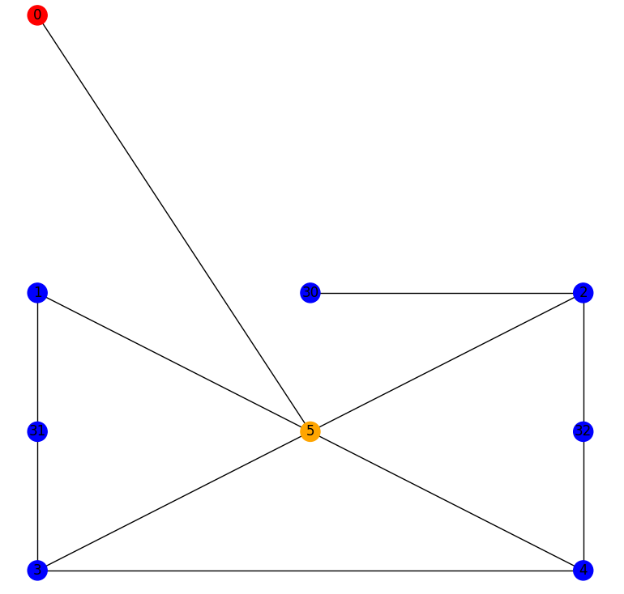

#### c) czy zmiana grafu do którego stosujemy produkcję poprzez zmianę etykiety losowego wierzchołka nie psuje tego mechanizmu

[test4](../../tests/test_p5.py)
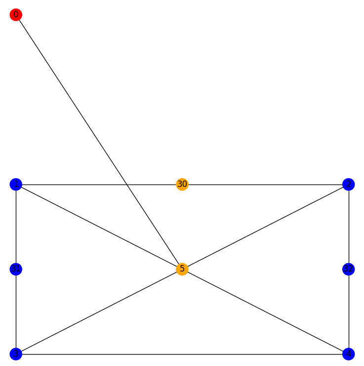

#### d) czy umieszczenie grafu izomorficznego z grafem lewej strony jako podgrafu większego grafu nie psuje tego mechanizmu

[test5](../../tests/test_p5.py)
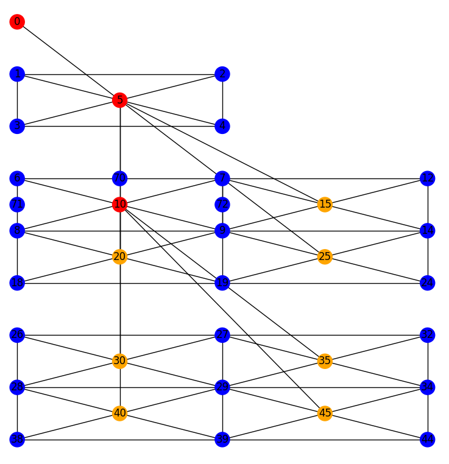

### 2. Czy produkcja dobrze się wykonała?

#### a) czy jeśli graf izomorficzny z grafem lewej strony jest umieszczony jako podgraf większego grafu, to czy produkcja nie „uszkadza” większego grafu

[test5](../../tests/test_p5.py)


#### b) czy jeśli graf izomorficzny z grafem lewej strony jest umieszczony w jako podgraf większego grafu, to czy produkcja dobrze transformuje osadzenie

[test6](../../tests/test_p5.py)
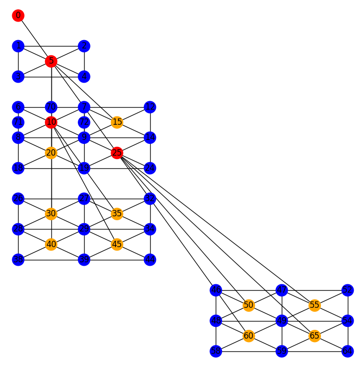

#### c) czy graf izomorficzny z grafem prawej strony jest poprawny (czy ma wszystkie wierzchołki, krawędzie i poprawne etykiety)

Z powodu braku połączeń pomiędzy małymi kwadratami połaczenie musi wystarczyć jako istnienie wierzchołków na pozycji x, y i połączeń wewnątrz mniejszych kwadratów
```python
for x in [0, 1, 2]:
    for y in [-3, -4, -5]:
        vertex = find_vertice_with_coordinates_and_remove_duplicates(x, y, lower_squares)
        assert vertex.label == VertexLabel.E
for x in [0.5, 1.5]:
    for y in [-3.5, -4.5]:
        vertex = find_vertice_with_coordinates_and_remove_duplicates(x, y, lower_squares)
        assert vertex.label == VertexLabel.I

assert lower_squares[0].edges == [(9, 8), (8, 6), (6, 7), (7, 9), (9, 10), (8, 10), (6, 10), (7, 10)]
assert lower_squares[1].edges == [(9, 7), (7, 12), (12, 14), (14, 9), (9, 15), (7, 15), (12, 15), (14, 15)]
assert lower_squares[2].edges == [(18, 8), (8, 9), (9, 19), (19, 18), (18, 20), (8, 20), (19, 20), (9, 20)]
assert lower_squares[3].edges == [(9, 14), (14, 24), (24, 19), (19, 9), (9, 25), (14, 25), (24, 25), (19, 25)]
```

[test7](../../tests/test_p5.py)
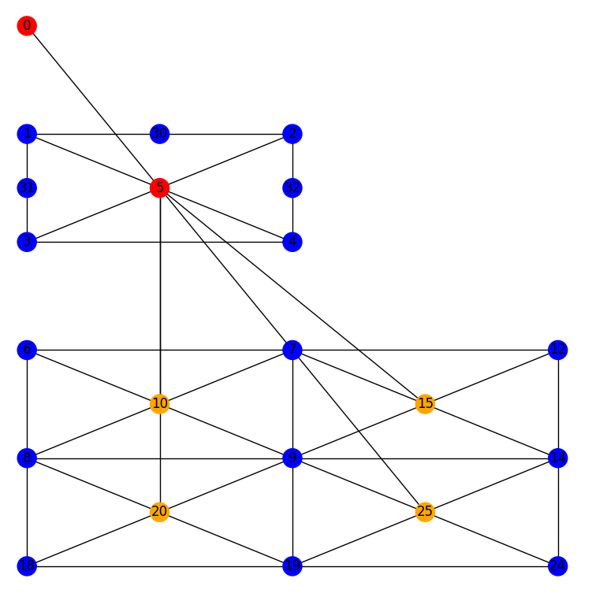

#### d) czy współrzędne nowych wierzchołków w tym grafie są poprawne

Wierzchołki da się wyliczyć za pomocą wzoru:

- kolumna: od `0` do  `2 ^ poziom`
- rząd: od `-sum for i in range(0, poziom): 2^poziom` do `-(sum for i in range(0, poziom) 2^poziom) - (2 ^ poziom)` (intuicja: suma wszystkich coraz większych kwadratów)

```python
for s in lower_squares:
    assert s.layer_number == lower_layer_number
for x in [0, 1, 2]:
    for y in [-3, -4, -5]:
        vertex = find_vertice_with_coordinates_and_remove_duplicates(x, y, lower_squares)
        assert vertex.label == VertexLabel.E
for x in [0.5, 1.5]:
    for y in [-3.5, -4.5]:
        vertex = find_vertice_with_coordinates_and_remove_duplicates(x, y, lower_squares)
        assert vertex.label == VertexLabel.I
```

[test7](../../tests/test_p5.py)


#### e) czy nowy graf umieszczony jest na poprawnym poziomie

```python
upper_layer_number = graph_fragment.layer_number
lower_layer_number = upper_layer_number + 1
lower_squares = [verticies_graph_fragment.get(x) for x in [10, 15, 20, 25]]
for s in lower_squares:
    assert s.layer_number == lower_layer_number
```

[test7](../../tests/test_p5.py)


### 3. Czy graf dobrze się rysuje?

#### a) czy są wszystkie wierzchołki i krawędzie

Kopia 2. c)

```python
for x in [0, 1, 2]:
    for y in [-3, -4, -5]:
        vertex = find_vertice_with_coordinates_and_remove_duplicates(x, y, lower_squares)
        assert vertex.label == VertexLabel.E
for x in [0.5, 1.5]:
    for y in [-3.5, -4.5]:
        vertex = find_vertice_with_coordinates_and_remove_duplicates(x, y, lower_squares)
        assert vertex.label == VertexLabel.I

assert lower_squares[0].edges == [(9, 8), (8, 6), (6, 7), (7, 9), (9, 10), (8, 10), (6, 10), (7, 10)]
assert lower_squares[1].edges == [(9, 7), (7, 12), (12, 14), (14, 9), (9, 15), (7, 15), (12, 15), (14, 15)]
assert lower_squares[2].edges == [(18, 8), (8, 9), (9, 19), (19, 18), (18, 20), (8, 20), (19, 20), (9, 20)]
assert lower_squares[3].edges == [(9, 14), (14, 24), (24, 19), (19, 9), (9, 25), (14, 25), (24, 25), (19, 25)]
```

[test7](../../tests/test_p5.py)


#### b) czy wierzchołki są narysowane w poprawnych współrzędnych

Kopia 2. d)

```python
for s in lower_squares:
    assert s.layer_number == lower_layer_number
for x in [0, 1, 2]:
    for y in [-3, -4, -5]:
        vertex = find_vertice_with_coordinates_and_remove_duplicates(x, y, lower_squares)
        assert vertex.label == VertexLabel.E
for x in [0.5, 1.5]:
    for y in [-3.5, -4.5]:
        vertex = find_vertice_with_coordinates_and_remove_duplicates(x, y, lower_squares)
        assert vertex.label == VertexLabel.I
```

[test7](../../tests/test_p5.py)


#### c) czy da się wybierać poziom grafu do narysowania

Niestety model tego nie oferuje

#### d) czy są narysowane etykiety wierzchołków

[test7](../../tests/test_p5.py)


#### e) czy jest zaznaczone które wierzchołki mają linki do poprzedniego lub następnego poziomu

[test7](../../tests/test_p5.py)


### 4. Czy zostały przygotowanie różne grafy do testowania

#### a) czy został przygotowany graf izomorficzny z grafem lewej strony produkcji, który jest poprawny

[test1](../../tests/test_p5.py)


#### b) czy został przygotowany graf izomorficzny z grafem lewej strony produkcji, który jest niepoprawny (bez jakiegoś wierzchołka)

[test2](../../tests/test_p5.py)


#### c) czy został przygotowany graf izomorficzny z grafem lewej strony produkcji, który jest niepoprawny (bez jakiejś krawędzi)

[test3](../../tests/test_p5.py)


#### d) czy został przygotowany graf izomorficzny z grafem lewej strony produkcji, który jest niepoprawny (z niepoprawną etykietą)

[test4](../../tests/test_p5.py)


#### e) czy został przygotowany graf izomorficzny z grafem lewej strony produkcji, który jest niepoprawny (z błędnymi współrzędnymi) 

Współrzeðne wirzechołka `31` to `(0, -1.6)` zamiast `(0, -1.5)` przez co produkcja nie zostaje zastosowana.

```python
graph_fragment.vertices.extend(list([Vertex(0.5, -1, 30, VertexLabel(1)), Vertex(0, -1.6, 31, VertexLabel(1)), Vertex(1, -1.5, 32, VertexLabel(1))]))
```

[test8](../../tests/test_p5.py)
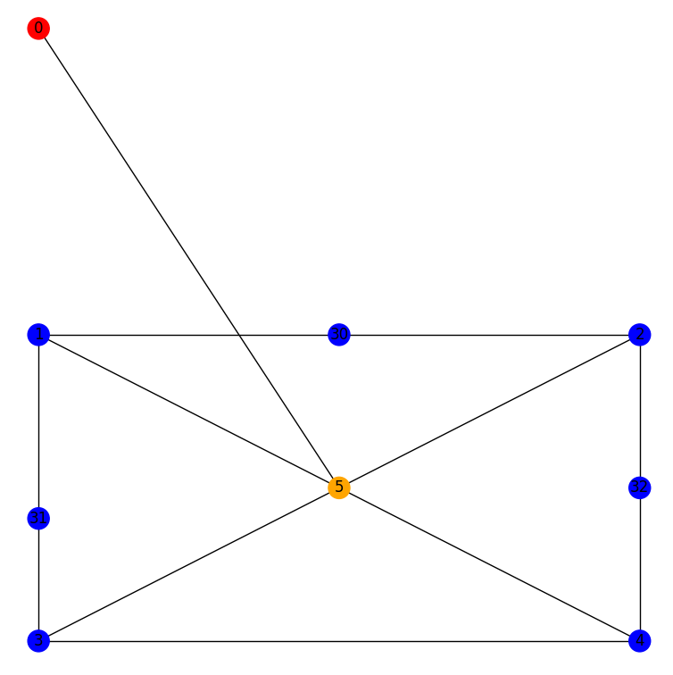

### 5. Czy wynik produkcji został dobrze sprawdzony


#### a) czy zostało sprawdzone czy produkcja wykonała się na poprawnym grafie i nie została wykonana na niepoprawnym grafie?

[test1](../../tests/test_p5.py)


[test2](../../tests/test_p5.py)


#### b) czy zostało sprawdzone czy jeśli graf lewej strony jest umieszczony w jako podgraf większego grafu, to czy produkcja nie uszkadza większego grafu

[test5](../../tests/test_p5.py)


#### c) czy zostało sprawdzone czy jeśli graf lewej strony jest umieszczony jako podgraf większego grafu, to czy produkcja dobrze transformuje osadzenie

[test6](../../tests/test_p5.py)


#### d) czy zostało sprawdzone czy graf prawej strony jest poprawny (czy ma wszystkie wierzchołki, krawędzie i poprawne etykiety)

[test7](../../tests/test_p5.py)


#### e) czy zostało sprawdzone czy współrzędne nowych wierzchołków są poprawne

[test7](../../tests/test_p5.py)


#### f) czy zostało sprawdzone czy nowy graf umieszczony jest na poprawnym poziomie

[test7](../../tests/test_p5.py)


## P6

[test1](../../tests/test_p6.py)
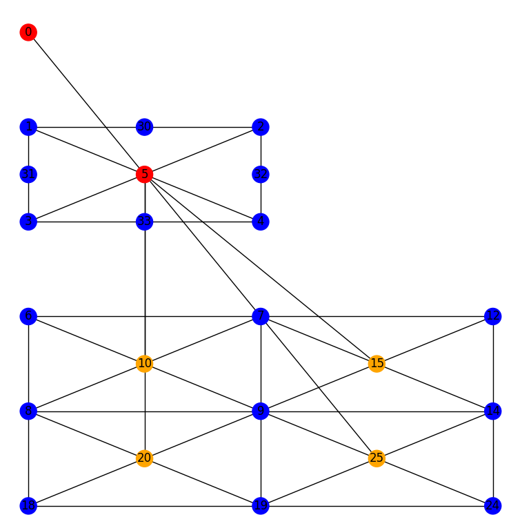

### 1. Czy produkcja sprawdza czy graf (podgraf grafu) do którego chcemy zastosować produkcję jest izomorficzny z grafem lewej strony produkcji (czy da się ją wykonać)? 

#### a) czy zmiana grafu do którego stosujemy produkcję poprzez usunięcie losowego wierzchołka nie psuje tego mechanizmu

[test2](../../tests/test_p6.py)
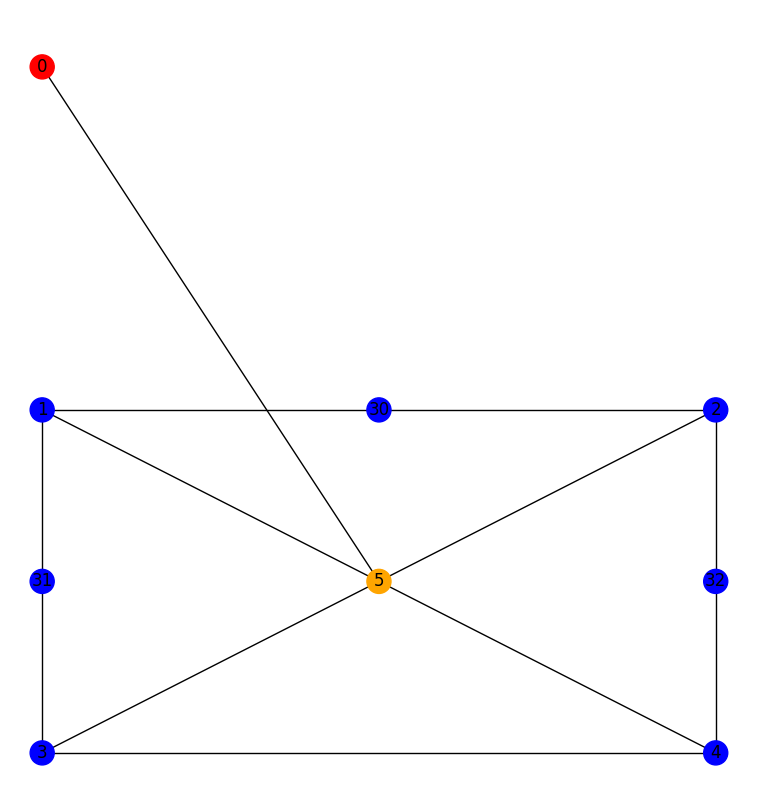

#### b) czy zmiana grafu do którego stosujemy produkcję poprzez usunięcie losowej krawędzi nie psuje tego mechanizmu

[test3](../../tests/test_p6.py)


#### c) czy zmiana grafu do którego stosujemy produkcję poprzez zmianę etykiety losowego wierzchołka nie psuje tego mechanizmu

[test4](../../tests/test_p6.py)
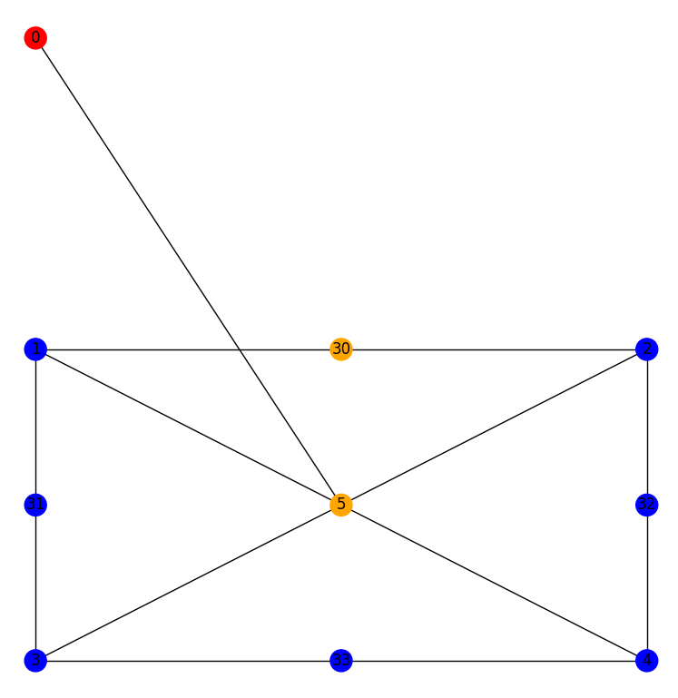

#### d) czy umieszczenie grafu izomorficznego z grafem lewej strony jako podgrafu większego grafu nie psuje tego mechanizmu

[test5](../../tests/test_p6.py)
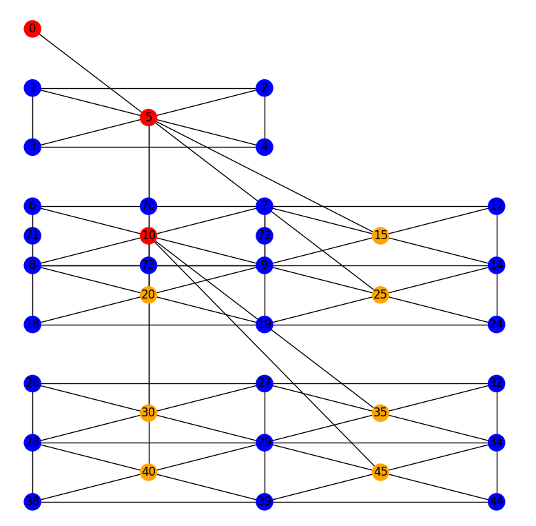

### 2. Czy produkcja dobrze się wykonała?

#### a) czy jeśli graf izomorficzny z grafem lewej strony jest umieszczony jako podgraf większego grafu, to czy produkcja nie „uszkadza” większego grafu

[test5](../../tests/test_p6.py)


#### b) czy jeśli graf izomorficzny z grafem lewej strony jest umieszczony w jako podgraf większego grafu, to czy produkcja dobrze transformuje osadzenie

[test6](../../tests/test_p6.py)
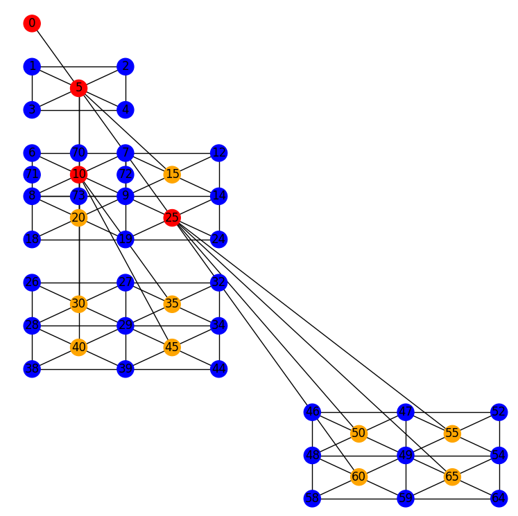

#### c) czy graf izomorficzny z grafem prawej strony jest poprawny (czy ma wszystkie wierzchołki, krawędzie i poprawne etykiety)

Z powodu braku połączeń pomiędzy małymi kwadratami połaczenie musi wystarczyć jako istnienie wierzchołków na pozycji x, y i połączeń wewnątrz mniejszych kwadratów
```python
for x in [0, 1, 2]:
    for y in [-3, -4, -5]:
        vertex = find_vertice_with_coordinates_and_remove_duplicates(x, y, lower_squares)
        assert vertex.label == VertexLabel.E
for x in [0.5, 1.5]:
    for y in [-3.5, -4.5]:
        vertex = find_vertice_with_coordinates_and_remove_duplicates(x, y, lower_squares)
        assert vertex.label == VertexLabel.I

assert lower_squares[0].edges == [(9, 8), (8, 6), (6, 7), (7, 9), (9, 10), (8, 10), (6, 10), (7, 10)]
assert lower_squares[1].edges == [(9, 7), (7, 12), (12, 14), (14, 9), (9, 15), (7, 15), (12, 15), (14, 15)]
assert lower_squares[2].edges == [(18, 8), (8, 9), (9, 19), (19, 18), (18, 20), (8, 20), (19, 20), (9, 20)]
assert lower_squares[3].edges == [(9, 14), (14, 24), (24, 19), (19, 9), (9, 25), (14, 25), (24, 25), (19, 25)]
```

[test7](../../tests/test_p6.py)
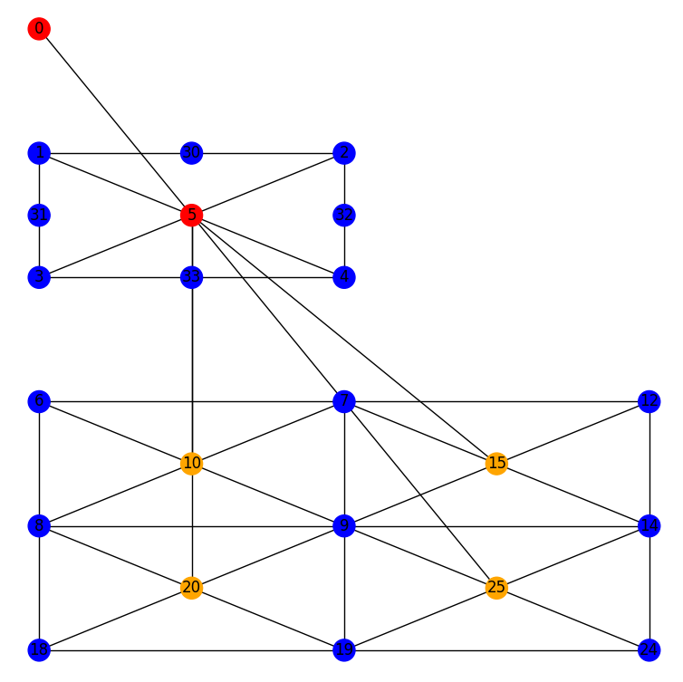

#### d) czy współrzędne nowych wierzchołków w tym grafie są poprawne

Wierzchołki da się wyliczyć za pomocą wzoru:

- kolumna: od `0` do  `2 ^ poziom`
- rząd: od `-sum for i in range(0, poziom): 2^poziom` do `-(sum for i in range(0, poziom) 2^poziom) - (2 ^ poziom)` (intuicja: suma wszystkich coraz większych kwadratów)

```python
for s in lower_squares:
    assert s.layer_number == lower_layer_number
for x in [0, 1, 2]:
    for y in [-3, -4, -5]:
        vertex = find_vertice_with_coordinates_and_remove_duplicates(x, y, lower_squares)
        assert vertex.label == VertexLabel.E
for x in [0.5, 1.5]:
    for y in [-3.5, -4.5]:
        vertex = find_vertice_with_coordinates_and_remove_duplicates(x, y, lower_squares)
        assert vertex.label == VertexLabel.I
```

[test7](../../tests/test_p6.py)


#### e) czy nowy graf umieszczony jest na poprawnym poziomie

```python
upper_layer_number = graph_fragment.layer_number
lower_layer_number = upper_layer_number + 1
lower_squares = [verticies_graph_fragment.get(x) for x in [10, 15, 20, 25]]
for s in lower_squares:
    assert s.layer_number == lower_layer_number
```

[test7](../../tests/test_p6.py)


### 3. Czy graf dobrze się rysuje?

#### a) czy są wszystkie wierzchołki i krawędzie

Kopia 2. c)

```python
for x in [0, 1, 2]:
    for y in [-3, -4, -5]:
        vertex = find_vertice_with_coordinates_and_remove_duplicates(x, y, lower_squares)
        assert vertex.label == VertexLabel.E
for x in [0.5, 1.5]:
    for y in [-3.5, -4.5]:
        vertex = find_vertice_with_coordinates_and_remove_duplicates(x, y, lower_squares)
        assert vertex.label == VertexLabel.I

assert lower_squares[0].edges == [(9, 8), (8, 6), (6, 7), (7, 9), (9, 10), (8, 10), (6, 10), (7, 10)]
assert lower_squares[1].edges == [(9, 7), (7, 12), (12, 14), (14, 9), (9, 15), (7, 15), (12, 15), (14, 15)]
assert lower_squares[2].edges == [(18, 8), (8, 9), (9, 19), (19, 18), (18, 20), (8, 20), (19, 20), (9, 20)]
assert lower_squares[3].edges == [(9, 14), (14, 24), (24, 19), (19, 9), (9, 25), (14, 25), (24, 25), (19, 25)]
```

[test7](../../tests/test_p6.py)


#### b) czy wierzchołki są narysowane w poprawnych współrzędnych

Kopia 2. d)

```python
for s in lower_squares:
    assert s.layer_number == lower_layer_number
for x in [0, 1, 2]:
    for y in [-3, -4, -5]:
        vertex = find_vertice_with_coordinates_and_remove_duplicates(x, y, lower_squares)
        assert vertex.label == VertexLabel.E
for x in [0.5, 1.5]:
    for y in [-3.5, -4.5]:
        vertex = find_vertice_with_coordinates_and_remove_duplicates(x, y, lower_squares)
        assert vertex.label == VertexLabel.I
```

[test7](../../tests/test_p6.py)


#### c) czy da się wybierać poziom grafu do narysowania

Niestety model tego nie oferuje

#### d) czy są narysowane etykiety wierzchołków

[test7](../../tests/test_p6.py)


#### e) czy jest zaznaczone które wierzchołki mają linki do poprzedniego lub następnego poziomu

[test7](../../tests/test_p6.py)


### 4. Czy zostały przygotowanie różne grafy do testowania

#### a) czy został przygotowany graf izomorficzny z grafem lewej strony produkcji, który jest poprawny

[test1](../../tests/test_p6.py)


#### b) czy został przygotowany graf izomorficzny z grafem lewej strony produkcji, który jest niepoprawny (bez jakiegoś wierzchołka)

[test2](../../tests/test_p6.py)


#### c) czy został przygotowany graf izomorficzny z grafem lewej strony produkcji, który jest niepoprawny (bez jakiejś krawędzi)

[test3](../../tests/test_p6.py)


#### d) czy został przygotowany graf izomorficzny z grafem lewej strony produkcji, który jest niepoprawny (z niepoprawną etykietą)

[test4](../../tests/test_p6.py)


#### e) czy został przygotowany graf izomorficzny z grafem lewej strony produkcji, który jest niepoprawny (z błędnymi współrzędnymi) 

Współrzeðne wirzechołka `31` to `(0, -1.6)` zamiast `(0, -1.5)` przez co produkcja nie zostaje zastosowana.

```python
graph_fragment.vertices.extend(list([Vertex(0.5, -1, 30, VertexLabel(1)), Vertex(0, -1.6, 31, VertexLabel(1)), Vertex(1, -1.5, 32, VertexLabel(1))]))
```

[test8](../../tests/test_p6.py)
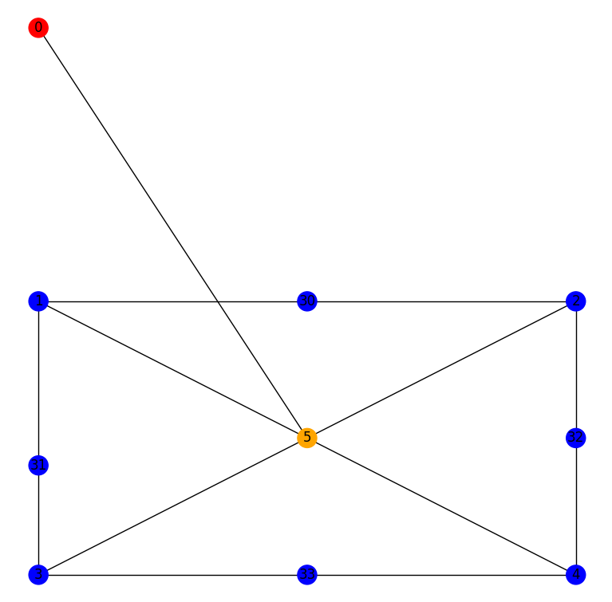

### 5. Czy wynik produkcji został dobrze sprawdzony


#### a) czy zostało sprawdzone czy produkcja wykonała się na poprawnym grafie i nie została wykonana na niepoprawnym grafie?

[test1](../../tests/test_p6.py)


[test2](../../tests/test_p6.py)


#### b) czy zostało sprawdzone czy jeśli graf lewej strony jest umieszczony w jako podgraf większego grafu, to czy produkcja nie uszkadza większego grafu

[test5](../../tests/test_p6.py)


#### c) czy zostało sprawdzone czy jeśli graf lewej strony jest umieszczony jako podgraf większego grafu, to czy produkcja dobrze transformuje osadzenie

[test6](../../tests/test_p6.py)


#### d) czy zostało sprawdzone czy graf prawej strony jest poprawny (czy ma wszystkie wierzchołki, krawędzie i poprawne etykiety)

[test7](../../tests/test_p6.py)


#### e) czy zostało sprawdzone czy współrzędne nowych wierzchołków są poprawne

[test7](../../tests/test_p6.py)


#### f) czy zostało sprawdzone czy nowy graf umieszczony jest na poprawnym poziomie

[test7](../../tests/test_p6.py)


